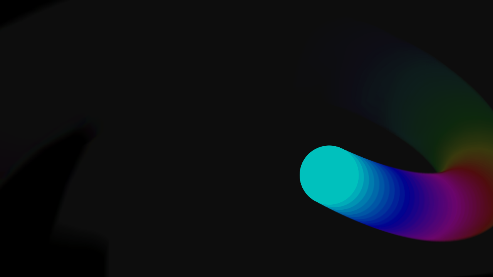
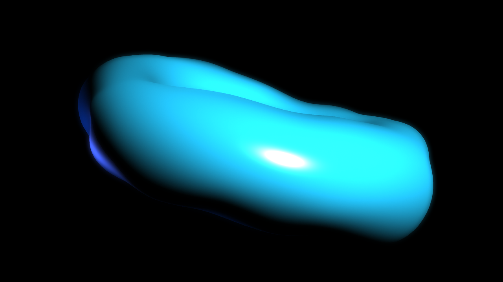
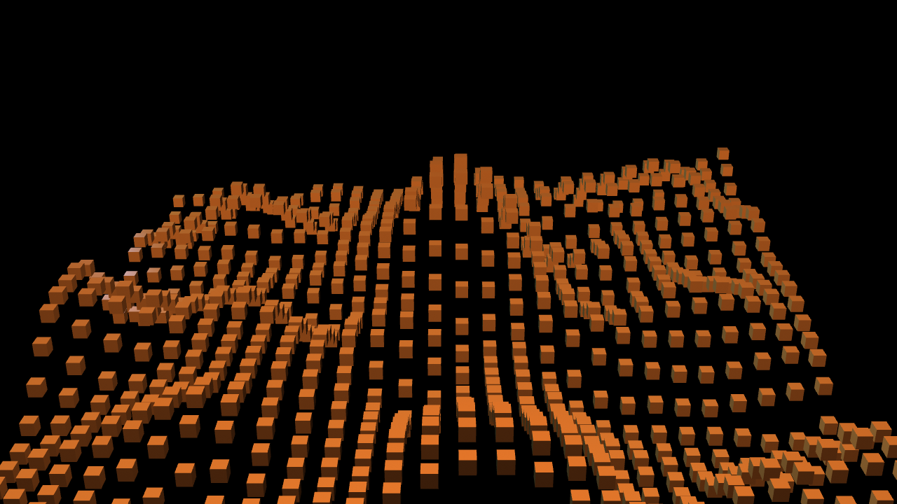

Three small, self-contained `.toe` projects that open and run with no external assets, plugins, or hardware. Built and verified in **TouchDesigner 2025.33060** on macOS: each file was opened fresh, played for 300+ frames, and checked for operator errors (zero found). Every project has an `about` Text DAT inside explaining the patch, and comments on the key nodes.

Download a `.toe`, double-click it, and press play. The interesting output is always in the `final` Null TOP inside `/project1`.

---

## NeonFeedback

**File:** [NeonFeedback.toe](NeonFeedback.toe) - *TOP feedback loop, 100% 2D*

A dot traces a Lissajous curve while a classic **Feedback TOP** loop recycles the previous frame with a slight zoom, rotate, opacity fade, and hue shift, so the dot leaves spiralling rainbow trails. This is the foundational pattern behind most "infinite trails" visuals.

Key ideas: [[touchdesigner/02_The_Operators/index|TOPs]], the Feedback TOP target loop, driving parameters with `absTime.seconds` [[touchdesigner/01_Core_Concepts/Expressions and Parameters|expressions]].

Things to try: raise `transform1` scale for a faster spiral, lower `level1` opacity for shorter trails, change the circle's speed multipliers.

## TorusBloom

**File:** [TorusBloom.toe](TorusBloom.toe) - *minimal 3D render pipeline*

A torus displaced by an animated **Noise SOP**, shaded with a Phong material, lit by two colored lights, rendered by a Camera + **Render TOP**, then finished with a cheap bloom (wide blur added back on top). This is the smallest complete 3D pipeline worth memorizing: SOP → Geo COMP → MAT → Camera/Light → Render TOP → post.

Key ideas: [[touchdesigner/03_Rendering_and_Output/index|the render pipeline]], SOP displacement, blur-and-add bloom.

Things to try: `noise1` amplitude and period inside `geo1`, the light colors, `blur1` size.

## InstanceField

**File:** [InstanceField.toe](InstanceField.toe) - *GPU instancing driven by CHOPs*

A 28×28 grid run through an animated Noise SOP becomes rolling terrain; a **SOP to CHOP** converts the point positions into `tx ty tz` channels, and a Geometry COMP instances one small box per sample: 784 boxes in a single draw call. Instancing is the workhorse technique behind almost every large-scale TD piece.

Key ideas: [[touchdesigner/02_The_Operators/index|CHOPs]], geometry instancing, SOP↔CHOP conversion.

Things to try: grid rows/cols (instance count), noise amplitude, box size, or insert a Math CHOP after `null_pos` to scale the terrain.

---

> [!note] Self-check DAT
> Each project contains a `ci_check` Execute DAT used for automated verification. It is inert unless the `TD_CI` environment variable is set; you can delete it freely.
